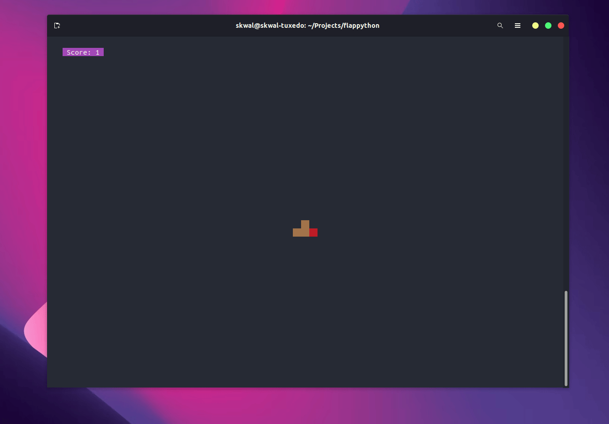
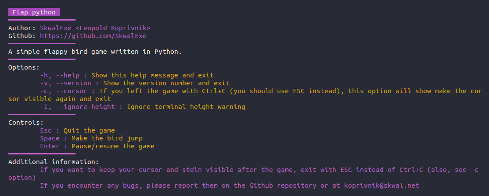

# Flap-python 🐤

This is a simple flappy bird game made with Python that you can play in your terminal.



# Installation

First, clone this repository and `cd` into it:

```bash
git clone https://github.com/SkwalExe/flap-python.git
cd flap-python
```

Then, install the dependencies:

```bash
pip install -r requirements.txt
```

Finally, launch the game with python
    
```bash
python3 src/main.py
```

# Usage



# Controls

- Use the `SPACE` key to make the bird flap
- Use `ESC` to quit the game
- Use `ENTER` to pause the game

# final

If you have any problem, dont hesitate to open an issue.

# contributing

Pull requests are welcome. For major changes, please open an issue first to discuss what you would like to change.    